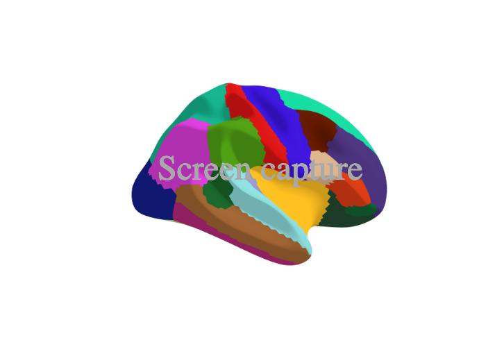
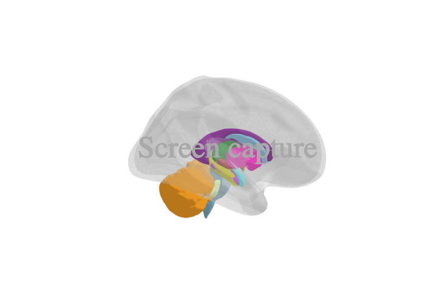

```{r, include = FALSE}
knitr::opts_chunk$set(
  collapse = TRUE,
  comment = "#>",
  fig.path = "man/img/README-",
  echo = TRUE
)
library(magrittr)
library(ggseg3d)
if (!require("processx")) install.packages("processx")
```


# ggseg3d  
<!-- badges: start -->
[](https://codecov.io/gh/ggseg/ggseg3d)
[](https://CRAN.R-project.org/package=ggseg3d)
[](https://r-pkg.org/pkg/ggseg)
[](https://lifecycle.r-lib.org/articles/stages.html)
[](https://github.com/LCBC-UiO/ggseg3d/actions)
<!-- badges: end -->

This package mainly contains a plotting function `ggseg3d` and data.frames of different brain atlases for plotting.
Plotting results of analyses on regions or networks often involves swapping between statistical tools, like R and Matlab, 
and software for brain imaging to correctly visualise analysis results.

This package aims to make it possible to plot results directly through R. 

## Atlases
There are currently four atlases available in the package:  

1. `dk_3d` - Desikan-Killiany atlas (aparc).   
2. `aseg_3d` - Automatic sub-cortical segmentation.  


If you want to create your own custom atlas or discover other compatible atlases, please see the companion package [ggsegExtra](https://ggseg.github.io/ggsegExtra/).

## Installation


ggseg3d can be installed from CRAN with:

```{r, eval = FALSE}
install.packages("ggseg3d")
```


We recommend installing {ggsegExtra} through the ggseg r-universe.

```{r eval = FALSE}
# Enable this universe
options(repos = c(
    ggseg = 'https://ggseg.r-universe.dev',
    CRAN = 'https://cloud.r-project.org'))

# Install some packages
install.packages('ggseg3d')
```

The package can be installed using {remotes}. The package includes some large datasets for the brain coordinates. Please be patient during download and install, it will take some time.

```{r eval=F}
install.packages("remotes")
remotes::install_github("ggseg/ggseg3d", build_vignettes = TRUE)
```

The functions are now installed, and you may load them when you want to use them.
All functions are documented in standard R fashion.

## Use
The package also has a vignette, to help you get started using it. 
You can access it [here](https://ggseg.github.io/ggseg3d/articles/ggseg3d.html), or via R:

```{r eval=F}
library(ggseg3d)
vignette("ggseg3d")
```

```{r results='hide'}
p <- ggseg3d(atlas=dk_3d) %>% 
  remove_axes() %>% 
  pan_camera("right lateral")
```
```{r, echo=FALSE}
p <- p %>% 
  plotly::add_annotations( text="Screen capture",
                  legendtitle=TRUE, showarrow=FALSE,
                  font = list(color = 'darkgrey',
                              family = 'sans serif',
                              size = 50)) 
plotly::orca(p, "man/img/README-dk_3d-plot.png")

```


```{r results = 'hide'}
p <- ggseg3d(atlas=aseg_3d) %>% 
  add_glassbrain() %>% 
  remove_axes() %>% 
  pan_camera("right lateral")
```
```{r, echo = FALSE}
p <- p %>% 
  plotly::add_annotations( text="Screen capture",
                  legendtitle=TRUE, showarrow=FALSE,
                  font = list(color = 'darkgrey',
                              family = 'sans serif',
                              size = 50)) 
plotly::orca(p, "man/img/README-aseg_3d-plot.png")

```

### Report bugs or requests  
Don't hesitate to ask for support using [github issues](https://github.com/ggseg/ggseg3d/issues), or requesting new atlases. 
While we would love getting help in creating new atlases, you may also request atlases through the issues, and we will try to get to it. 

# Funding
This tool is partly funded by:  

**EU Horizon 2020 Grant:** Healthy minds 0-100 years: Optimising the use of European brain imaging cohorts (Lifebrain).

**Grant agreement number:** 732592.

**Call:** Societal challenges: Health, demographic change and well-being

